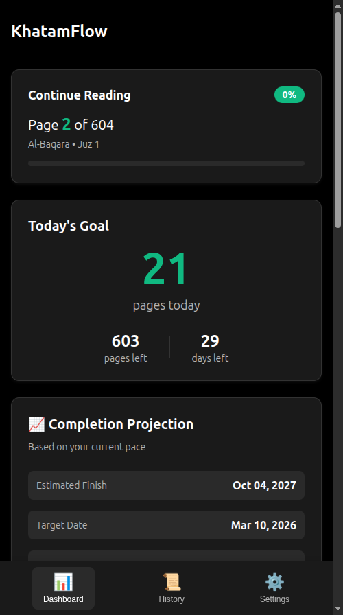
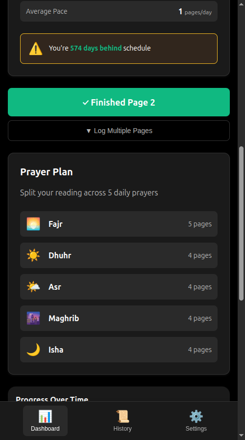
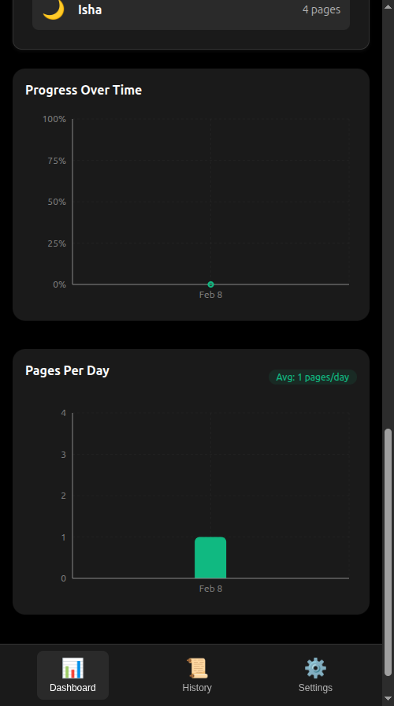
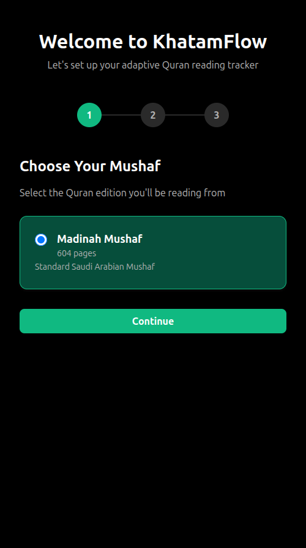
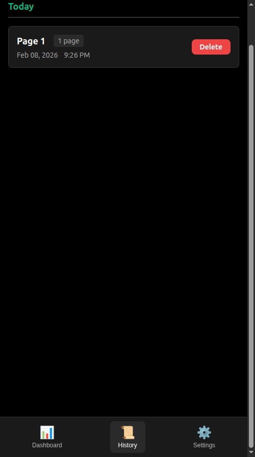
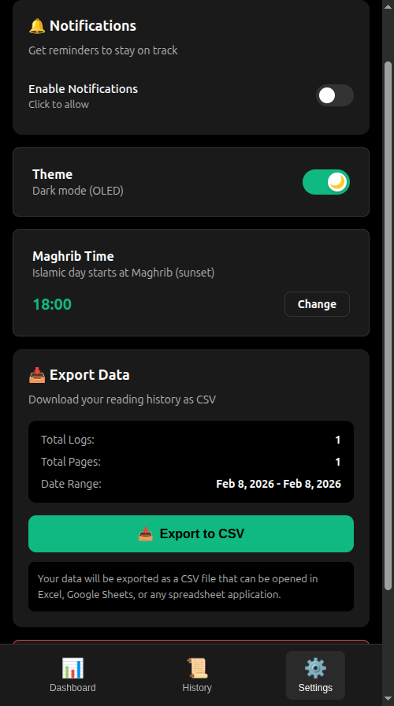

<div align="center">


# KhatamFlow

**Finish the Quran on your own pace — without the burnout.**

An adaptive Quran reading tracker that dynamically adjusts your daily goals so you stay consistent, not overwhelmed.

[Try It Now](https://khatamflow.netlify.app) | [Report Bug](https://github.com/alvintriseptia/KhatamFlow/issues)

</div>

---

<div align="center">
  
  &nbsp;&nbsp;
  
  &nbsp;&nbsp;
  
  <br /><br />
  <sub>Dashboard &bull; Prayer Plan &bull; Progress Charts — all in OLED dark mode</sub>
</div>

---

## The Problem

Every Ramadan, millions of Muslims set out to complete the Quran in 30 days. Most fall behind by week two, face an impossible backlog, and give up.

**KhatamFlow fixes this.** Instead of a rigid "20 pages/day" schedule, it recalculates your daily goal after every reading session. Fall behind? The goal nudges up gently. Read ahead? It eases off. No guilt, no spikes, no burnout.

## How It Works

```
Daily Pages = ceil( (Total Pages - Current Page) / Days Remaining )
```

That's it. One formula, recalculated after every log. The result:

- **Behind schedule?** Daily goal increases *gradually* — no impossible catch-ups
- **Ahead of schedule?** Daily goal decreases — you earned a lighter day
- **Maghrib-based days** — respects the Islamic day boundary (sunset to sunset)
- **Prayer splitting** — distributes pages across 5 daily prayers

## Features

| | Feature | Description |
|---|---|---|
| **Adaptive** | Smart Recalculation | Daily goal auto-adjusts after every session |
| **Fast** | 2-Tap Logging | Log progress in under 3 seconds |
| **Offline** | Works Anywhere | 100% functional without internet (PWA) |
| **Private** | Zero Tracking | No accounts, no analytics, no ads |
| **Visual** | Progress Charts | See your journey with clear visualizations |
| **Flexible** | Prayer Splitting | Distribute pages across your 5 daily prayers |
| **Dark** | OLED Dark Mode | Pure black theme for nighttime reading |
| **Portable** | Data Export | Export your history as CSV anytime |

<details>
<summary><b>More screenshots</b></summary>
<br />
<div align="center">
  
  &nbsp;&nbsp;
  
  &nbsp;&nbsp;
  
  <br /><br />
  <sub>Onboarding &bull; Reading History &bull; Settings</sub>
</div>
</details>

## Quick Start

### Use it now (no install needed)

**[khatamflow.netlify.app](https://khatamflow.netlify.app)**

Works on any device. Install as a PWA for the full experience.

### Run locally

```bash
git clone https://github.com/alvintriseptia/KhatamFlow.git
cd KhatamFlow
npm install
npm run dev
```

## Tech Stack

| Layer | Technology |
|---|---|
| Framework | React 18 + TypeScript |
| Build | Vite |
| State | Zustand |
| Storage | IndexedDB via `idb` |
| PWA | vite-plugin-pwa |
| Dates | date-fns |

## Built for Ramadan 2026

KhatamFlow was built with one goal: make completing the Quran during Ramadan feel achievable, not stressful.

All data stays on your device. No sign-ups. No cloud. Just you and the Quran.

---

<div align="center">

**[Start Your Journey](https://khatamflow.netlify.app)**

*"Indeed, this Quran guides to that which is most suitable"* — Quran 17:9

</div>

## License

MIT
